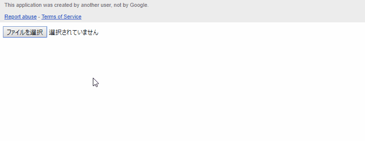

Resumable Upload for Web Apps using Google Apps Script
=====

# Overview
This is a sample script for uploading files with large size (> 50 MB) at Web Apps using Google Apps Script (GAS). The resumable upload method is used for uploading files. This script can be also applied to the script using gapi of javascript.

# Demo

This is a demonstration of this script. As a demonstration, it uploads a file with the size of 100 MB to my Google Drive. When the file was selected, it is uploaded by the resumable upload. It is found that the file can be completely uploaded.

# Description
Have you ever thought that you want to upload files with large size from local PC at Web Apps using GAS? Recently, I have thought it. So I investigated about this situation. At first, it was found that there are some limitations for uploading files to Google Drive from local PC.

1. When "uploadType" is used as "media" and "multipart", [the limitation of size is less than 5 MB (5,242,880 bytes)](https://developers.google.com/drive/v3/web/manage-uploads).
    - This is the specification of Drive API.
1. When "google.script.run.function(file)" is used, the limitation of size if less than 50 MB (52,428,800 bytes).
    - This is the specification of "DriveApp.createFile(blob)".
    - "blob" can be used for the size more than 50 MB. But a file cannot be created using "DriveApp.createFile(blob)". Furthermore, "blob" with the size more than 50 MB cannot be converted to the byte array.
        - This is due to my experiments.

When users want to upload files with the size more than 50 MB to Google Drive, [the Resumable Upload](https://developers.google.com/drive/v3/web/resumable-upload) is required to be used. As the next step, although I have looked for the sample script, Unfortunately, I couldn't find it. So I created this. The flow of this sample script is as follows.

1. Retrieve a file.
1. Retrieve an access token from GAS.
    - In this sample script, GAS is mainly used for retrieving the access token.
1. Retrieve the endpoint for the resumable upload using the access token.
1. Upload chunks for the resumable upload to the endpoint.

If this was useful for you, I'm glad.

# Usage
There are 2 script files. One is "Code.gs" which is GAS. Another is "index.html" which is HTML including javascript. Please install those as follows.

1. Create new project.
    - You can use the project of both the standalone type and the container-bound script type.
1. On the script editor.
    1. Put the script of "Code.gs" to "Code.gs" in the cerated project.
    1. Create a html file at "File" -> "New" -> "Html file".
    1. Put the script of "index.html" to the created html file.
        - Please also include the commented lines. This is the important point. The commented lines are used for automatically enabling Drive API and adding a scope of "https://www.googleapis.com/auth/drive" by the script editor.
    1. Deploy Web Apps.
        - "Publish" -> "Deploy as web apps..."
        - Input "Describe what has changed..." to "Project version" as NEW.
        - Select "Me" to "Execute the app as:".
        - Select "Only myself" to "Who has access to the app:".
        - Click "Deploy".
        - Click "latest code" of Test web app for your latest code."
            - By this, new tab of browser is opened and this script is run.
            - When the file is selected from your local PC, the file is uploaded to your Google Drive.

>
- About deploying Web Apps, at above setting, only you can upload files in your Google Drive. If you want to set other patterns of Web Apps, you can see the detail information of each setting at [here](https://github.com/tanaikech/taking-advantage-of-Web-Apps-with-google-apps-script).
>
- In this script, if [you retrieve an access token using gapi](https://developers.google.com/api-client-library/javascript/features/authentication), you can upload files using this script at the sites except for Web Apps.

-----

# Licence
[MIT](LICENCE)

# Author
[Tanaike](https://tanaikech.github.io/about/)

If you have any questions and commissions for me, feel free to tell me.

# Update History
* v1.0.0 (May 17, 2018)

    1. Initial release.

* v1.0.1 (May 18, 2019)

    1. I noticed that the specification of Google Apps Script.
        - This script uses a scope of ``https://www.googleapis.com/auth/drive``.
        - When the code of ``DriveApp.getFiles()`` is put in the script, the script editor automatically detects the scope of ``https://www.googleapis.com/auth/drive`` before. But now, When the code of ``DriveApp.getFiles()`` is put in the script, the script editor detects as ``https://www.googleapis.com/auth/drive.readonly``. By this, when the script is run, an error occurs.
        - In this modification, in order to make the script editor detect the scope of ``https://www.googleapis.com/auth/drive``, I put the code ``DriveApp.createFile()`` instead of ``DriveApp.getFiles()`` as a comment line. By this, I could confirm the script worked fine.
        - This issue was reported by [this issue](https://github.com/tanaikech/Resumable_Upload_For_WebApps/issues/3).

[TOP](#TOP)
